# Адитья Бхаргава
### Грокаем алгоритмы. Второе издание 2024

## Определения:
> __Алгоритм:__ это набор инструкций для выполнения некоторой
> задачи. В принципе любой фрагмент программного кода можно назвать
> алгоритмом, но в этой книге рассматриваются более интересные темы. 

> __Массивы:__ это структура данных, состоящая из фиксированного количества элементов одного типа, расположенных в 
> непрерывной области памяти. Каждый элемент массива имеет уникальный индекс, который позволяет быстро получать 
> доступ к элементам по их позиции.  
> 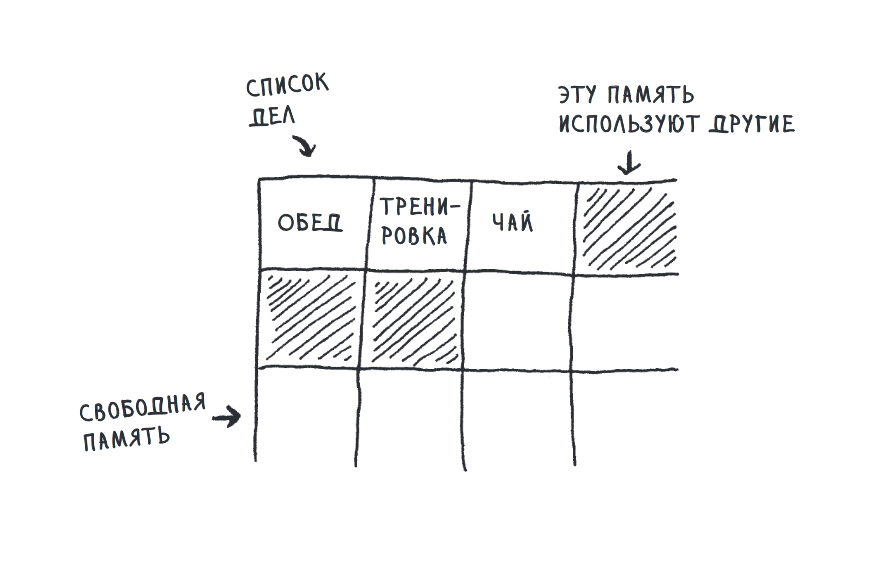

> __Связанные списки:__ это структура данных, состоящая из узлов, где каждый узел содержит данные и ссылку 
> (или указатель) на следующий узел в последовательности. В отличие от массивов, связанные списки не требуют
> непрерывного выделения памяти и могут динамически изменять свой размер.
> 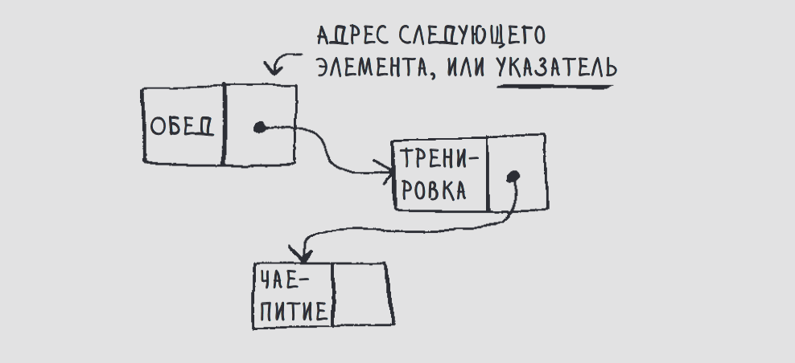

> _Сортировка выбором:_ Самый простой тип сортировки который исполняется за время `O(n*n)` или `O(n^2)`.
> Фактическая скорость выполнения данного алгоритма быстрее почти в 2 раза чем O(n^2) а именно `O((n(n+1))\2)`.
> Сам алгоритм прост. Последовательно проверяется каждый элемент массива и сравнивается со всеми остальными.
> Самый маленький элемент копируется в новый массив. Таким образом формируется новый массив из отсортированных 
> значений по возрастанию из старого массива.
> 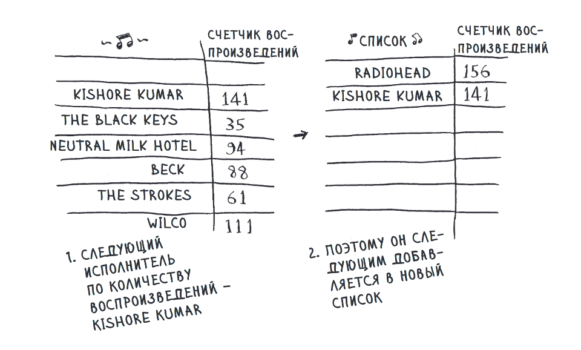

> _Быстрая сортировка:_ Она работает намного быстрее сортировки выбором и часто применяется в реальных программах. 
> Быстрая сортировка также основана на стратегии «разделяй и властвуй». Алгоритм быстрой сортировки работает так: 
> сначала в массиве выбирается элемент, который называется опорным. Далее мы проверяем все элементы списка
> и разделяем их на два массива. В массив слева помещаются элементы меньше опорного, а в массив справа те что больше.
> Время выполнения алгоритма в лучшем случае `O(n * log n)` а в худшем `O(n*n)` или `O(n^2)`
> 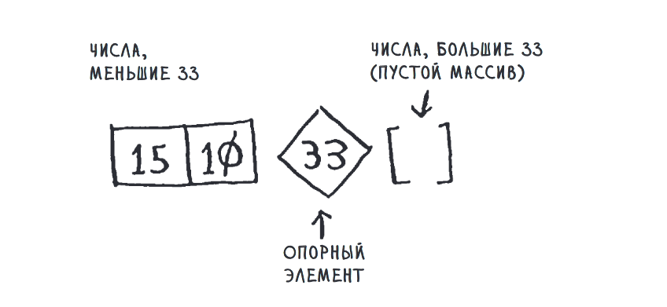

> __Хеш-таблица:__ Сами по себе таблици реализованы на основе массива, таким образом доступ к 
> определенному элементу таблици осуществляется, как и в массиве со скоростью O(1). При помощи хеш-функции текстовая 
> строка приравнивается в рамках таблици с определенным индексом массива и через это строковое представление 
> мгновенно получает доступ к значению. Они также известны под другими названиями: «ассоциативные массивы»,
> «словари», «отображения», «хеш-карты» или просто «хеши». В Python это словарь.  
> 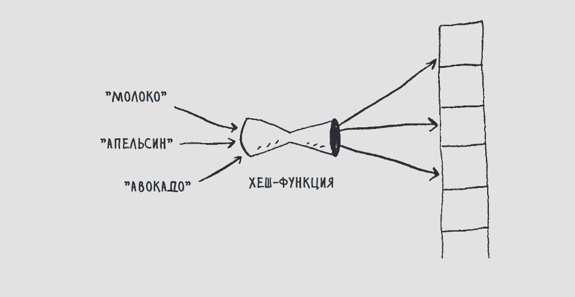

> __Хеш-функция:__ представляет собой функцию, которая получает строку и возвращает число. В научной терминологии
> говорят, что хеш-функция «отображает строки на числа». 
> Проще говоря хеш-функция связывает строки с числами.  
> 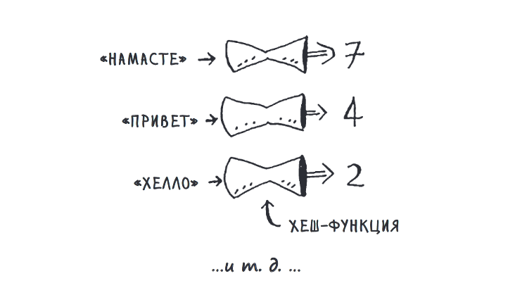 

> __Коллизия:__ ситуация, когда два или более элемента данных (например, хеш-значения) совпадают, 
> что может привести к ошибкам или неэффективности в обработке информации.  
> Если несколько ключей отображаются на один элемент, в этом элементе создается связанный список.
> 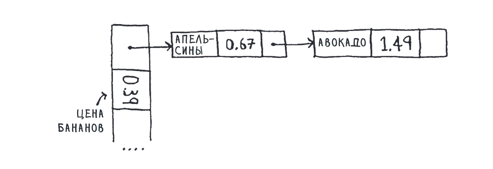
> Если связанные списки становятся слишком длинными, работа с хеш-таблицей сильно замедляется.
> 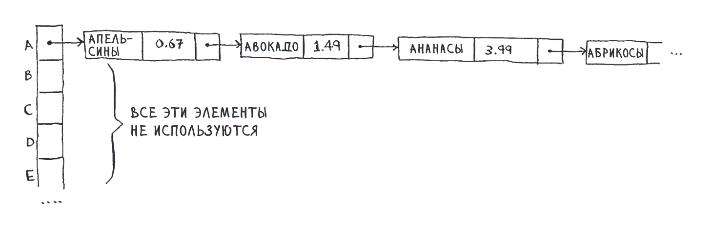

> __Стек:__ вы не можете обращаться к произвольным элементам стека. Вместо этого поддерживаются
> всего две операции: добавить в стек и извлечение из стека. Стек принадлежит к числу структур
> данных LIFO: Last In, First Out («последним пришел, первым вышел»).
> 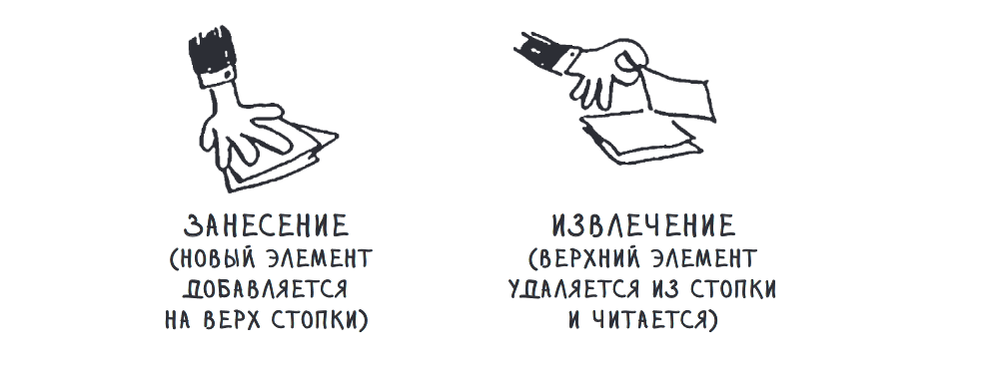

> __Рекурсия:__ это вызов функцией самой себя. Когда вы пишете рекурсивную функцию, в ней необходимо указать, в 
> какой момент следует прервать рекурсию. Вот почему каждая рекурсивная функция состоит из двух частей: 
> базового случая и рекурсивного случая. В рекурсивном случае функция вызывает сама себя. В базовом случае
функция себя не вызывает, чтобы предотвратить зацикливание.
> 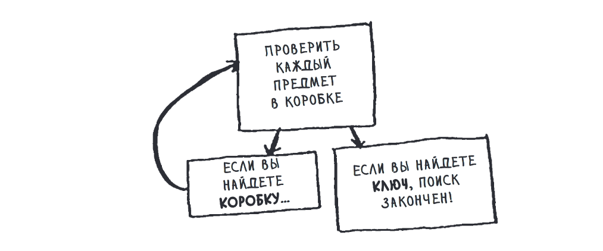
> >«Циклы могут ускорить работу программы. Рекурсия может ускорить работу программиста. 
> Выбирайте, что важнее в вашей ситуации!»

> __Очередь:__ вы не можете обращаться к произвольным элементам очереди. Вместо этого поддерживаются 
> всего две операции: постановка в очередь и извлечение из очереди. Очередь относится к категории 
> структур данных FIFO: First In, First Out («первым вошел, первым вышел»).
> 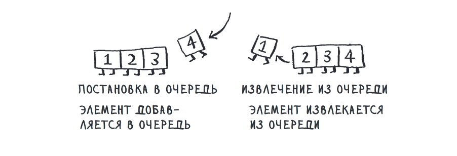

> __Граф:__ Граф моделирует набор связей. Графы состоят из узлов и ребер. Узел может быть напрямую соединен с 
> несколькими другими узлами. Эти узлы называются внутренними или внешними соседями.
> 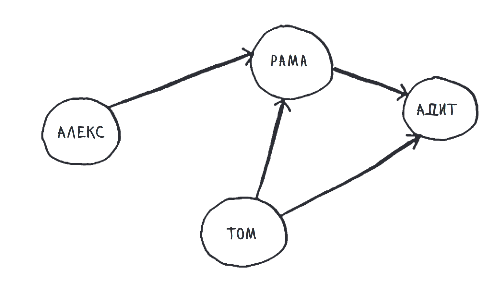

> __Поиск в ширину:__ Поиск в ширину позволяет найти кратчайшее расстояние между двумя объектами. Однако сам 
> термин «кратчайшее расстояние» может иметь много разных значений! 
> 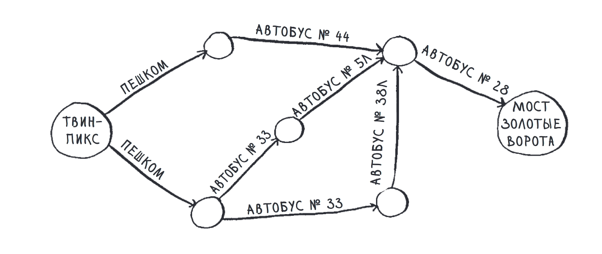

> __Дерево:__ это разновидность графа. Как и графы, деревья состоят из узлов и ребер. В дереве узлы имеют по крайней 
> мере одного родителя. Существует только один узел без родителя — это корневой узел.
> 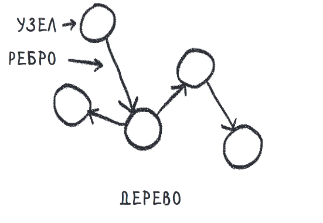

> __Алгоритм Хаффмана или Алгоритм сжатия:__ Алгоритмы сжатия сокращают количество битов, необходимых для представления каждого символа.
> К примеру используя кодировку ISO-8859-1, один символ занимает 8 бит или 1 байт, однако при помощи алгоритма
> сжатия может потребоваться намного меньше, к примеру 2 бита. Это достигается при помощи создания дерева с новыми
> значениями кодировки.
> 

> __BST:__ Сбалансированное бинарное дерево поиска. Как и в бинарном дереве, каждый узел имеет до двух дочерних узлов: левый
и правый. Но у этого дерева есть одно свойство, относящее его к BST: значение левого дочернего узла всегда меньше, 
> чем значение узла, а значение правого дочернего узла всегда больше. 
> 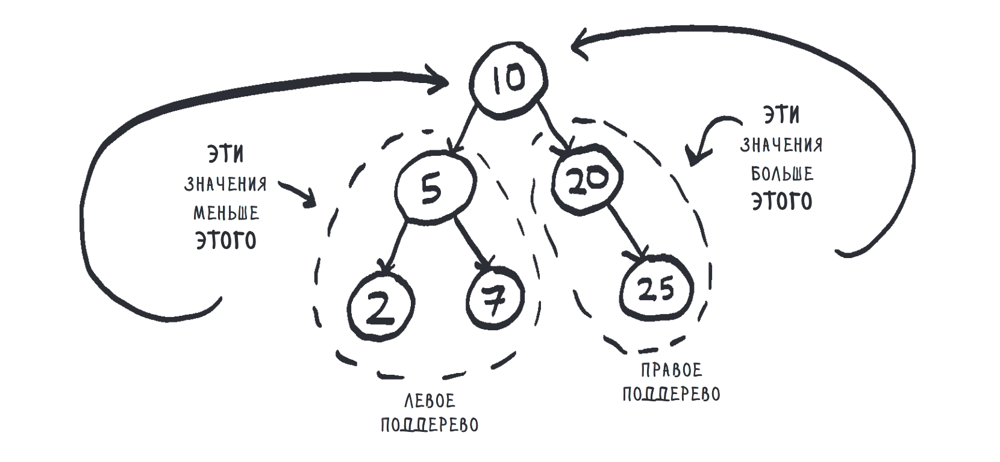
s

## Скорость выполнения алгоритма
| Формула         | Описание                                                                              |
|-----------------|---------------------------------------------------------------------------------------|
| `O(log2 n)`     | Логарифмическое время. Пример: бинарный поиск. Пример: `O(log2 128)` `=` `7 итераций` |
| `O(n)`          | Линейное время. Пример: простой поиск. Пример `O(128)` `=` `128 итераций`             |
| `O(n * log2 n)` | Эффективные алгоритмы сортировки. Пример `O(128 * log2 128)` `=` `896 итераций`       |
| `O(n**2)`       | Медленные алгоритмы сортировки. Пример `O(128 * 128)` `=` `16_384 итераций`           |
| `O(n!)`         | Очень медленные алгоритмы. Пример `O(10!)` `=` `3_628_800 итераций`                   |

## Бинарный поиск:
> Бинарный поиск — это алгоритм который на входе получает отсортированный список элементов. 
> Если элемент, который вы ищете, присутствует в списке, то бинарный поиск возвращает ту позицию, в которой он был найден.
> Алгоритм бинарного поиска состоит из постоянного деления на 2.
> Так же при делении нужно проверять значение больше, меньше или равно искомому, тем самым
> если число больше то берем ту половину деления что больше, если меньше то ту что меньше.  
> 

> Мы загадали число x которое равняется 8.  
> `x = 8 `  
> __Первая итерация:__ `128:2 = 64 => x < 64 =>`  
> __Вторая итерация:__ `64:2 = 32 => x < 32 =>`  
> __Третья итерация:__ `32:2 = 16 => x < 16 =>`  
> __Четвертая итерация:__ `16:2 = 8 => x == 8`  
> Загаданное число найдено с `4` попытки. 

> В общем случае для списка из n элементов бинарный поиск выполняется за `log``2` `n` шагов, 
> тогда как простой поиск будет выполнен за n шагов.
> Например log2128 = 7  
> 27 = 128  <=>  log2128 = 7
